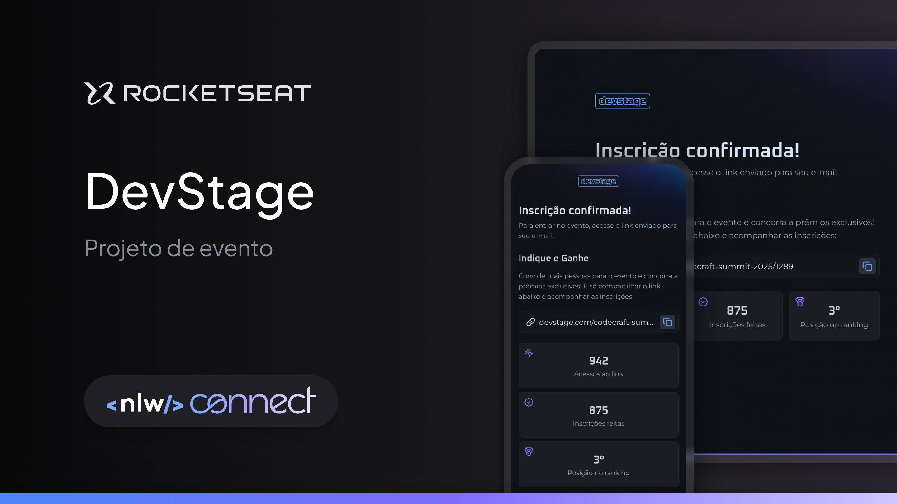

<!-- CABEÇALHO -->

    <h1>
      DevStage 
    </h1>
    

        <a href="#%EF%B8%8F-sobre-o-projeto">Sobre o Projeto</a> •
        <a href="#-endpoints">Endpoints</a> •
        <a href="#%EF%B8%8F-tecnologias">Tecnologias</a> •
        <a href="#-autor">Autor</a>
    

    

        
    

<!-- SOBRE O PROJETO -->

## 🖥️ Sobre o Projeto

> Projeto desenvolvido durante a 19ª edição da Next Level Week da [Rocketseat](https://www.rocketseat.com.br/), ocorrida entre 17 e 20 de fevereiro de 2025.

Esse projeto consiste em uma aplicação back-end de um sistema de inscrição e indicação de eventos.

O objetivo do desenvolvimento desse projeto foi praticar a linguagem de programação Java e seus fundamentos juntamente com o framework Spring Boot.

Através dessa aplicação, um usuário pode se inscrever em um evento, gerar um link de indicação para um evento, ver o ranking de indicações e ver a quantidade de inscritos que se isncreveram com seu link.

<!-- ENDPOINTS -->

## 💡 Endpoints

| Método | Endpoint                                 | Responsabilidade                                         |
| ------ | ---------------------------------------- | -------------------------------------------------------- |
| POST   | /events                                  | Cria um evento                                           |
| GET    | /events                                  | Lista todos os eventos                                   |
| GET    | /events/:prettyName                      | Busca por um evento específico                           |
| POST   | /subcription/:prettyName                 | Inscreve usuário em um evento                            |
| POST   | /subcription/:prettyName/:userId         | Inscreve usuário em um evento através de indicação       |
| GET    | /subcription/:prettyName/ranking         | Obtém o ranking de indicações de um evento               |
| GET    | /subcription/:prettyName/ranking/:userId | Obtém o ranking de um usuário em indicações de um evento |

<!-- TECNOLOGIAS -->

## 🛠️ Tecnologias

Para o desenvolvimento desse projeto, as seguintes ferramentas foram utilizadas:

- **[Java](https://www.java.com/pt-BR/)**
- **[Spring Boot](https://spring.io/projects/spring-boot)**
- **[Maven](https://maven.apache.org/)**
- **[Docker](https://www.docker.com/)**
- **[MySQL](https://www.mysql.com/)**

## 👨‍💻 Autor

Marcos Kenji Kuribayashi

 

---

Desenvolvido por Marcos Kenji Kuribayashi 😉
